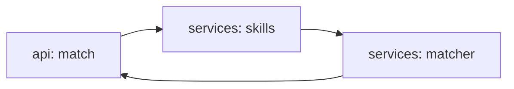

# agent-job-posting

[](https://github.com/Shamanchi/agent-job-posting/actions/workflows/ci.yml)
[](https://www.python.org/)
[](./Dockerfile)
[](./LICENSE)

> **English TL;DR:** FastAPI job-matching agent: extracts skills from a job description and a resume against a known vocabulary, scores the fit, lists gaps and gives a verdict. Fully offline, no tokens needed.

Агент сопоставления вакансий и резюме: извлекает навыки из описания вакансии и резюме по словарю, считает скор соответствия, показывает пробелы и вердикт. Работает офлайн.

Источник темы: `Hands-On-AI-Engineering / P-129 (job_posting_agent)` — идею и постановку взяли из каталога, код и тексты написаны с нуля.

## Какую задачу решает

Соискателю нужно понять шансы на вакансию: агент находит в текстах известные навыки, считает долю совпадения с требованиями, показывает недостающие навыки и вердикт (strong/fit/weak).

## Архитектура



Слои: `api/` → `services/` → `core/`, настройки через `pydantic-settings`.

## Быстрый старт

```bash
cp .env.example .env
pip install -r requirements.txt
uvicorn app.main:app --reload
curl -X POST http://127.0.0.1:8000/api/v1/match -H "Content-Type: application/json" -d "{\"job_description\": \"Python FastAPI Docker\", \"resume\": \"Python FastAPI SQL\"}"
```

Docker:

```bash
docker compose up --build
```

## API

- `GET /api/v1/health` — проверка сервиса.
- `GET /api/v1/skills` — словарь навыков.
- `POST /api/v1/match` — сопоставление. Тело: `{"job_description": "...", "resume": "...", "required_skills": [...]}`. Ответ: `match_score`, `matched`, `missing`, `verdict`.

Пример ответа `match` (сокращённо):

```json
{
  "match_score": 0.67,
  "matched": ["fastapi", "python"],
  "missing": ["docker"],
  "verdict": "fit"
}
```

## Переменные окружения (.env)

| Переменная | Назначение | По умолчанию |
|---|---|---|
| `STRONG_THRESHOLD` | Скор для вердикта strong | `0.8` |
| `FIT_THRESHOLD` | Скор для вердикта fit | `0.5` |
| `APP_HOST` / `APP_PORT` | Хост/порт API | `0.0.0.0` / `8000` |

Полный список — в [.env.example](./.env.example).

## Тесты

```bash
pip install -r requirements.txt
pytest -q
pytest -q -m integration
```

Unit-тесты без сети. Интеграционные (`-m integration`) — через TestClient, тоже без сети.

## Контакты

- Telegram: @PavelYrevichh
- Email: Lietman46@mail.ru
- GitHub: Shamanchi
- FL.ru: https://www.fl.ru/users/Shamanchi
